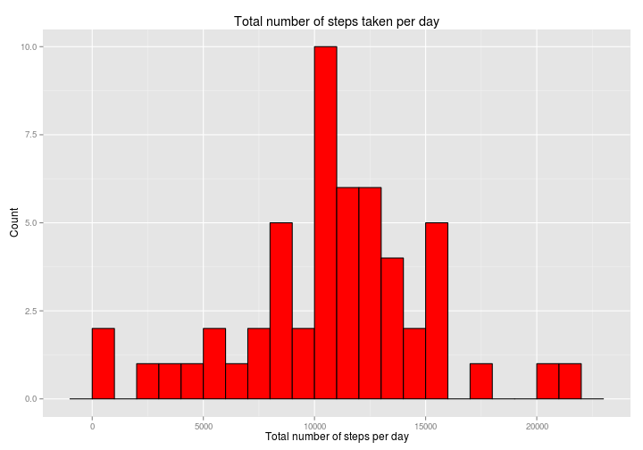

# Reproducible Research: Peer Assessment 1


## Loading and preprocessing the data


```r
options(scipen=999)
zipPath <- "activity.zip";
filename <- "activity.csv";
csvfile <- unz (zipPath, filename);
raw_data <- read.csv(csvfile)
clean_data = raw_data[!is.na(raw_data$steps), ]
non_zero_data = clean_data[clean_data$steps != 0, c('date', 'steps')]

# group data by date and sum the steps
aggregate_data <- aggregate(x=non_zero_data$steps, by=list(non_zero_data$date), FUN = sum)
colnames(aggregate_data) <- c('date', 'total_steps')
aggregate_data$month_date <- substr(aggregate_data$date, 6, nchar(as.character(aggregate_data$date)))

mean_steps = mean(aggregate_data$total_steps)
median_steps = median(aggregate_data$total_steps)
```

## What is mean total number of steps taken per day?


```r
library(ggplot2)
p1 <- ggplot(data=aggregate_data, aes(x=aggregate_data$month_date,y=aggregate_data$total_steps)) + geom_bar(stat="identity", fill="red") + ggtitle("Total steps by date") + xlab('Year 2012') + ylab('Total Steps') + theme(axis.text.x = element_blank())
print (p1)
```

 

1. The mean total number of steps is 10766.1887.
2. The median total number of steps is 10765.

## What is the average daily activity pattern?


## Imputing missing values


## Are there differences in activity patterns between weekdays and weekends?
