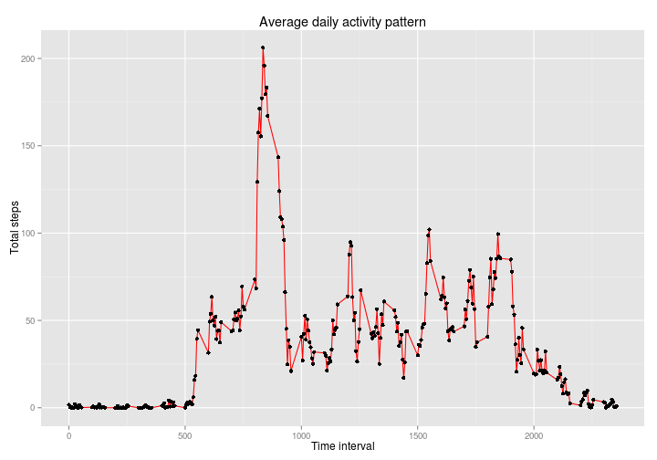
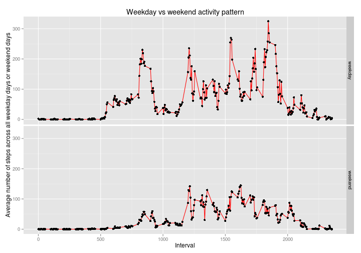

# Reproducible Research: Peer Assessment 1


## Loading and preprocessing the data


```r
library(plyr)
options(scipen=999)
zipPath <- "activity.zip";
filename <- "activity.csv";
csvfile <- unz (zipPath, filename);
raw_data <- read.csv(csvfile)
clean_data <- raw_data[!is.na(raw_data$steps), ]

# group data by date and sum the steps
aggregate_data <- aggregate(x=clean_data$steps, by=list(clean_data$date), FUN = sum)
colnames(aggregate_data) <- c('date', 'total_steps')

mean_steps = mean(aggregate_data$total_steps)
median_steps = median(aggregate_data$total_steps)

# aggregate steps by intervals
aggregate_interval <- aggregate(x=clean_data$steps, by=list(clean_data$interval), FUN = sum)
colnames(aggregate_interval) <- c('interval', 'total_steps')

aggregate_num_date <- count(clean_data, "interval")
colnames(aggregate_num_date) <- c("interval","num_dates")

aggregate_interval <- cbind(aggregate_interval, aggregate_num_date$num_dates)
colnames(aggregate_interval) <- c("interval", "total_steps", "num_dates")
aggregate_interval$avg_steps <- aggregate_interval$total_steps / aggregate_interval$num_dates

max_interval <- aggregate_interval[aggregate_interval$avg_steps == max(aggregate_interval$avg_steps), c('interval')]

num_missing_data_row <- nrow(raw_data[is.na(raw_data$steps), ])

# create a new dataset with missing data filled in.
new_ds <- raw_data
ds_missing <- new_ds[is.na(new_ds$steps), ]
ds_filled <- new_ds[!is.na(new_ds$steps), ]
mat <- as.matrix(ds_missing)

for (i in 1:nrow(mat)) {
 mat[i, "steps"] <- aggregate_interval[aggregate_interval$interval == as.integer(mat[i, "interval"]), "avg_steps" ]
}
new_ds <- rbind(ds_filled,as.data.frame(mat))
new_ds$interval <- as.integer(new_ds$interval)
new_ds$steps <- as.numeric(new_ds$steps)
new_ds$wday <- as.POSIXlt(new_ds$date)$wday
new_ds$factor <- ifelse(new_ds$wday %in% c(1,2,3,4,5), 'weekday', 'weekend')

agg_data_input <- aggregate(x=new_ds$steps, by=list(new_ds$date), FUN = sum)
colnames(agg_data_input) <- c('date', 'total_steps')

mean_steps_input = mean(agg_data_input$total_steps)
median_steps_input = median(agg_data_input$total_steps)

# sum steps by weekday/weekend and interval
agg_factor_interval <- count(new_ds, c("factor", "interval"))
agg_data_wday <- aggregate(x=new_ds$steps, by=list(new_ds$factor, new_ds$interval), 
                           FUN = sum)
colnames(agg_data_wday) <- c('wday', 'interval', 'total_steps')

agg_data_wday$freq <- agg_factor_interval[ agg_factor_interval$factor == agg_data_wday$wday && agg_factor_interval$interval == agg_data_wday$interval, "freq"]                    

agg_data_wday$avg_step <- agg_data_wday$total_steps / agg_data_wday$freq
```

## What is mean total number of steps taken per day?


```r
library(ggplot2)
p1 <- ggplot(aggregate_data, aes(x=aggregate_data$total_steps))
p1 <- p1 + geom_histogram(fill="red", color="black", binwidth=1000) + ggtitle("Total number of steps taken per day") + xlab('Total number of steps per day') + ylab('Count')
print (p1)
```

 

1. The mean total number of steps taken per day is 10766.1887.
2. The median total number of steps taken per day is 10765.

## What is the average daily activity pattern?


```r
p2 <- ggplot(aggregate_interval, aes(y=aggregate_interval$avg_steps, x=aggregate_interval$interval))
p2 <- p2 + geom_line(color="red") + geom_point()
p2 <- p2 + xlab('Time interval') + ylab('Total steps') + ggtitle('Average daily activity pattern')
print (p2)
```

 

1. The 5-minute interval that contains the maximum average number of steps taken is 835.

## Inputing missing values

1. Number of rows with NA data equals 2304.
2. My strategy fills the missing data with the mean of the 5-minute interval across all days.
3. The mean total number of steps taken per day is 10766.1887.
4. The median total number of steps taken per day is 10766.1887.
5. The mean and median are the same in this part. The mean in this part is the same as first part while median in this part is larger than the median in the first part. One significance difference is the bar of interval 10000 - 11000. The value increases from 10 to approximately 18. Since the number of non-zero values has increased; therefore, the median shifts right.


```r
p3 <- ggplot(agg_data_input, aes(x=agg_data_input$total_steps))
p3 <- p3 + geom_histogram(fill="red", color="black", binwidth=1000) + ggtitle("Frequency of total steps taken per day with inputs") + xlab('Total number of steps per day') + ylab('Count')
print (p3)
```

 

## Are there differences in activity patterns between weekdays and weekends?

```r
p4 <- ggplot(agg_data_wday, aes(y=avg_step, x=interval))
p4 <- p4 + facet_grid(wday ~ .)
p4 <- p4 + geom_line(color="red") + geom_point()
p4 <- p4 + xlab('Interval') + ylab('Average number of steps across all weekday days or weekend days') + ggtitle('Weekday vs weekend activity pattern')
print (p4)
```

 

1. Assume the plots are correct, people walk much less in weekend than in weekday.
